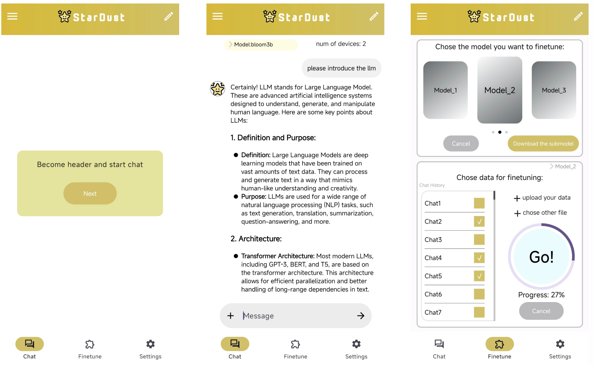

# StarDust

This project consists of two main components: a server-side application for running distributed AI models and a mobile app client.

## App Demonstration

Below is a demonstration image of the StarDust mobile application interface:



## Server-Side Setup

### Prerequisites

- Python 3.8 or higher
- CUDA-compatible GPU (recommended)
- Git

### Installation

1. Clone the repository:
   ```bash
   git clone https://github.com/stardust-project/StarDust.git
   cd StarDust
   ```

2. Install dependencies:
   ```bash
   pip install -r requirement.txt
   ```

3. Make sure your environment is properly set up with the necessary GPU drivers and CUDA toolkit if you're using GPU acceleration.

### Running the Server

To start the server with the 560M parameter Bloom model:

```bash
python 560m_root_bloom.py
```

This script will:
- Initialize the model
- Set up ZMQ sockets for client communication
- Wait for client devices to connect
- Distribute model computation across connected devices

You can modify the configuration in the script to:
- Adjust the number of connected devices (`device_number`)
- Change the model split size (`split_size`)
- Enable/disable runtime load balancing (`runtime_option`)
- Change the model quantization options

## App-Side Setup

### Installation

1. Download and install the StarDust app from the provided APK file or build it from source using Android Studio.

2. Build from source (optional):
   ```bash
   cd android
   ./gradlew assembleDebug
   ```

### Configuration

After installing the app:

1. Open the app and navigate to the settings page.

2. Configure the server connection:
   - Enter the server IP address
   - Make sure the device is on the same network as the server
   - The default port for communication is specified in the app settings

3. Additional configuration options:
   - Model optimization level
   - Memory usage limits
   - Task type selection

### Usage

1. After connecting to the server, the app will receive portions of the model to execute.

2. The app will display status information during model execution including:
   - Connection status
   - Computation progress
   - Resource utilization

## System Requirements

### Server
- Linux or macOS operating system
- CUDA-compatible GPU (recommended)
- At least 16GB RAM
- Sufficient disk space for model weights

### App
- Android 8.0 or higher
- At least 4GB RAM
- ARMv8 processor
- At least 1GB of free storage

## Troubleshooting

If you encounter connection issues:
- Make sure the server and app are on the same network
- Check that your firewall allows ZMQ connections
- Verify the IP address is correctly entered in the app

For model execution problems:
- Check CUDA installation on the server
- Ensure the mobile device has enough memory available
- Check logs for specific error messages 